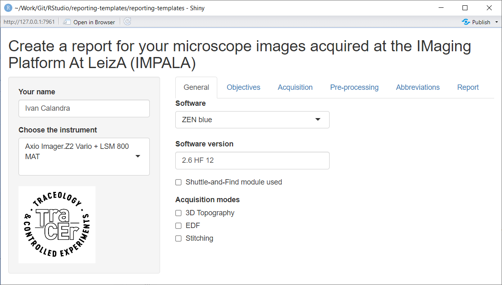

# reporting-templates

**Table of content**

<!-- TOC depthfrom:2 -->

- [Purpose](#purpose)
- [How to use the App](#how-to-use-the-app)
    - [Pre-requisites](#pre-requisites)
    - [Download the repository](#download-the-repository)
    - [Start the App](#start-the-app)
    - [Operating instructions](#operating-instructions)
        - [Introduction](#introduction)
        - [Side bar](#side-bar)
        - [Tab "General"](#tab-general)
        - [Tab "Objectives"](#tab-objectives)
        - [Tab "Acquisition"](#tab-acquisition)
        - [Tab "Pre-processing"](#tab-pre-processing)
        - [Tab "Abbreviations"](#tab-abbreviations)
        - [Tab "Report"](#tab-report)
- [How to adapt the App](#how-to-adapt-the-app)
- [How to contribute](#how-to-contribute)
- [License](#license)

<!-- /TOC -->

## Purpose
This repository contains a **[Shiny App](reporting-templates/app.R)** that guides users to **create a report for microscope images acquired at the Imaging Platform at LEIZA ([IMPALA](https://www.leiza.de/forschung/infrastrukturen/labore/impala)) with all the necessary metadata.**

Once all fields are entered, **the report can be exported to an XLSX file**.  
I would have preferred to export to a truly open format, but I believe that several sheets are more appropriate (so no CSV) and the export to ODS does not work for an unknown reason.

**This report can and should be published together with the image data.** While publishing them as a supplementary material to a paper is OK, I recommend publishing everything in open access on an online repository like [Zenodo](https://zenodo.org/), [Figshare](https://figshare.com/) or [OSF](https://osf.io/) for easy and long-term accessibility. Additionally or alternatively, the report could be attached to a protocol, for example on [protocols.io](https://www.protocols.io/). 

The App is designed for the instruments available at the [IMPALA](https://www.leiza.de/forschung/infrastrukturen/labore/impala) and currently includes only the digital microscope (Zeiss Smartzoom 5) and the upright light microscope + LSCM (Zeiss Imager.Z2 Vario + LSM 800 MAT). More instruments will be added later.

If you would like to adapt the App to your instrument(s), check the sections [How to adapt the App](#how-to-adapt-the-app), [How to contribute](#how-to-contribute) and [License](#license).

## How to use the App
I am planning to make the App available online on a server, but the App can currently only be run locally.

### Pre-requisites
The repository and the Shiny App have been written in [RStudio](https://posit.co/products/open-source/rstudio/), so you first need to download and install [R](https://www.r-project.org/) and [RStudio](https://posit.co/download/rstudio-desktop/).  
But fear not, **no knowledge of R/Rstudio is needed to run the App**!

### Download the repository
There are two ways to get the App:
1. Download my [GitHub repository](https://github.com/ivan-paleo/reporting-templates/archive/refs/heads/main.zip) or its latest [release](https://github.com/ivan-paleo/reporting-templates/releases) as a ZIP archive, and unzip it.
2. [Fork and clone](https://happygitwithr.com/fork-and-clone.html) my GitHub repository.

### Start the App
1. Open the file [reporting-templates.Rproj](reporting-templates.Rproj) with RStudio.  

2. Open the file `reporting-templates/app.R` from within RStudio by clicking on it in the `Files` panel.

3. Run the App by clicking on the button `Run App` in the top right corner.

4. The App will open in a new RStudio window. Alternatively, click on `Open in Browser` at the top to open the App within your favorite browser (Firefox, Chrome...). It does not make much difference, though, whether the App is opened in RStudio or in the browser.

5. Enter the information as explained in the following section ([Operating instructions](#operating-instructions)).

### Operating instructions
#### Introduction

#### Side bar

#### Tab "General"

#### Tab "Objectives"

#### Tab "Acquisition"

#### Tab "Pre-processing"

#### Tab "Abbreviations"

#### Tab "Report"

## How to adapt the App
I have tried to make the code of the App as clear as possible and to comment it as much as possible. This is surely not perfect, especially because the code is long and imbricated, but I hope this will be enough for future developments and adaptations.

If you would like to adapt the App to your instrument(s), feel free to do so on your own (see section [Download the repository](#download-the-repository)). Nevertheless, **I would appreciate if you would be willing to [contribute](#how-to-contribute)**! You can also get in touch with me directly.

## How to contribute
I appreciate any comment from anyone (expert or novice) to improve this App, so do not be shy! There are three possibilities to contribute:

1. Submit an issue  
If you notice any problem or have a question, submit an [issue](https://docs.github.com/en/issues/tracking-your-work-with-issues/about-issues). You can do so [here](https://github.com/ivan-paleo/reporting-templates/issues).  

2. Propose changes  
If you know how to write a [Shiny App](https://shiny.rstudio.com/), please propose text edits as a [pull request](https://docs.github.com/en/pull-requests/collaborating-with-pull-requests/proposing-changes-to-your-work-with-pull-requests/about-pull-requests) (abbreviated "PR").

3. Send me an email  
For options 1-2, you need to create a GitHub account. If you do not have one and do not want to sign up, you can still write me an email (Google me to find my email address).

By participating in this project, you agree to abide by our [code of conduct](CONDUCT.md).

## License
[![CC BY-NC-SA 4.0][cc-by-nc-sa-shield]][cc-by-nc-sa]

This work is licensed under a
[Creative Commons Attribution-NonCommercial-ShareAlike 4.0 International License][cc-by-nc-sa].

Author: Ivan Calandra

[![CC BY-NC-SA 4.0][cc-by-nc-sa-image]][cc-by-nc-sa]

[cc-by-nc-sa]: http://creativecommons.org/licenses/by-nc-sa/4.0/
[cc-by-nc-sa-image]: https://licensebuttons.net/l/by-nc-sa/4.0/88x31.png
[cc-by-nc-sa-shield]: https://img.shields.io/badge/License-CC%20BY--NC--SA%204.0-lightgrey.svg

*License badge and image from Soler S. cc-licenses: Creative Commons Licenses for GitHub Projects, https://github.com/santisoler/cc-licenses.*
