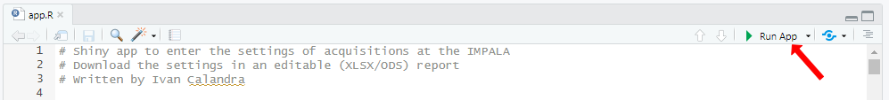
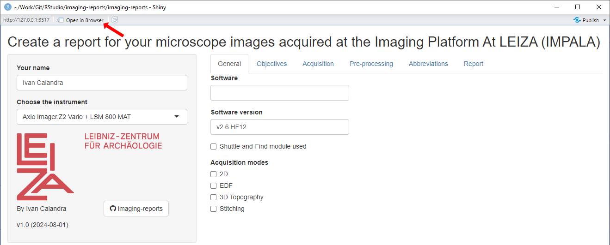
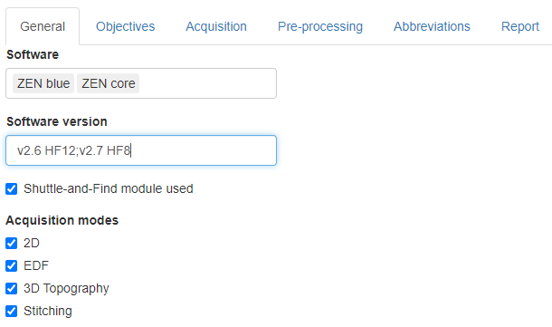
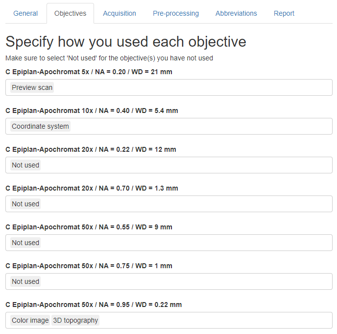
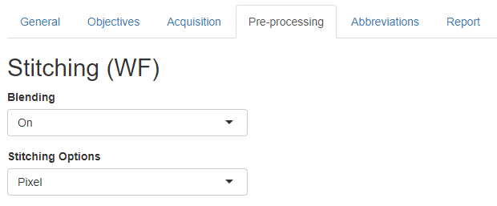

<!-- TOC ignore:true -->
# reporting-templates

<!-- TOC ignore:true -->
## Table of content

<!-- TOC -->

- [Purpose](#purpose)
- [How to use the App](#how-to-use-the-app)
    - [Pre-requisites](#pre-requisites)
    - [Download the repository](#download-the-repository)
    - [Start the App](#start-the-app)
- [Operating instructions](#operating-instructions)
    - [Introduction](#introduction)
    - [Side bar](#side-bar)
    - [Tab "General"](#tab-general)
    - [Tab "Objectives"](#tab-objectives)
    - [Tab "Acquisition"](#tab-acquisition)
    - [Tab "Pre-processing"](#tab-pre-processing)
    - [Tab "Abbreviations"](#tab-abbreviations)
    - [Tab "Report"](#tab-report)
- [How to adapt the App](#how-to-adapt-the-app)
- [How to contribute](#how-to-contribute)
- [License](#license)

<!-- /TOC -->

---

# Purpose

This repository contains a [**Shiny App**](reporting-templates/app.R) that guides users to **create a report for microscope images acquired at the Imaging Platform at LEIZA ([IMPALA](https://www.leiza.de/forschung/infrastrukturen/labore/impala)) with all the necessary metadata.**

Once all fields are entered, **the report can be exported to an XLSX file**.  
I would have preferred to export to a truly open format, but I believe that several sheets are more appropriate (so no CSV) and the export to ODS does not work for an unknown reason.

**This report can and should be published together with the image data.** While publishing them as a supplementary material to a paper is OK, I recommend publishing everything in open access on an online repository like [Zenodo](https://zenodo.org/), [Figshare](https://figshare.com/) or [OSF](https://osf.io/) for easy and long-term accessibility. Additionally or alternatively, the report could be attached to a protocol, for example on [protocols.io](https://www.protocols.io/).

The App is designed for the instruments available at the [IMPALA](https://www.leiza.de/forschung/infrastrukturen/labore/impala) and currently includes only the digital microscope (Zeiss Smartzoom 5) and the upright light microscope + LSCM (Zeiss Imager.Z2 Vario + LSM 800 MAT). More instruments will be added later.

If you would like to adapt the App to your instrument(s), check the sections [How to adapt the App](#how-to-adapt-the-app), [How to contribute](#how-to-contribute) and [License](#license).

---

# How to use the App
I am planning to make the App available online on a server, but the App can currently only be run locally.

## Pre-requisites
The repository and the Shiny App have been written in [RStudio](https://posit.co/products/open-source/rstudio/), so you first need to download and install [R](https://www.r-project.org/) and [RStudio](https://posit.co/download/rstudio-desktop/).\ But fear not, **no knowledge of R/Rstudio is needed to run the App**!

## Download the repository
There are two ways to get the App: 
1. Download my [GitHub repository](https://github.com/ivan-paleo/reporting-templates/archive/refs/heads/main.zip) or its latest [release](https://github.com/ivan-paleo/reporting-templates/releases) as a ZIP archive, and unzip it.  
2. [Fork and clone](https://happygitwithr.com/fork-and-clone.html) my GitHub repository.

## Start the App
1.  Open the file [reporting-templates.Rproj](reporting-templates.Rproj) with RStudio.
2.  Open the file `reporting-templates/app.R` from within RStudio by clicking on it in the `Files` panel.

><figure><figcaption align="center"><i>Open the App from within RStudio.</i></figcaption></figure>

>  
>
<i>Open the App from within RStudio.</i>

>

>     
>    <i>Open the App from within RStudio.</i>
>

     
    <i>Open the App from within RStudio.</i>

3.  Run the App by clicking on the button `Run App` in the top right corner.

<figure>

<figcaption align="center"><i>Run the App from within RStudio.</i></figcaption>
</figure>

4.  The App will open in a new RStudio window. Alternatively, click on `Open in Browser` at the top to open the App within your favorite browser (Firefox, Chrome...). It does not make much difference, though, whether the App is opened in RStudio or in the browser.

<figure>

<figcaption align="center"><i>App freshly opened (no input yet).</i></figcaption>
</figure>

5.  Enter the information as explained in the following section ([Operating instructions](#operating-instructions)).

---

# Operating instructions
## Introduction
- In a strict sense, none of the fields are required. Yet, it is important that **you fill as many fields as possible**. Unedited fields will be filled with default values, so make sure you change them in case you did not apply default values.  
- Some information that will be included in the report (see [tab "Report"](#tab-report)) is hard coded and does not depend on your input because it depends on the hardware only. Because of that (and other things), make sure you **use the latest version of the App**.  
- **Every entered information summarizes all acquisitions about which you are reporting.** Therefore, do not fill the forms for every single acquisition bur rather for all acquisitions of a project.
- While it is possible to jump from any tab to any other, conditional input (i.e. input based on other input) might not update correctly. Therefore, I recommend that you **start in the side bar and then fill in every tab from left ("General") to right ("Pre-processing")**. The tab "Report" can be consulted any time to check how the output will look like.
- **Refer to the instrument's user manual if you need information about the settings.**

## Side bar
**Enter your name and select the instrument you used from the list.**  
Start again at the tab "General" if you switch to another instrument.

## Tab "General"
**Select the software you used from the list and enter the version(s).**  
Make sure you specify the full details of the version including hot fixes (HF).  
If you used more than 1 software packages, enter the versions in the same order as the software packages and separate them with semi-colons **without** space (e.g. "v12 HF5;v3 HF2").

<figure>

<figcaption align="center"><i>General tab for the Axio Imager.Z2 Vario + LSM 800 MAT.</i></figcaption>
</figure>

<figure>

<figcaption align="center"><i>General tab for the Smartzoom 5.</i></figcaption>
</figure>

## Tab "Objectives"
**Select from the list how each objective has been used.**  
On the Axio Imager.Z2 Vario + LSM 800 MAT:  
- Several uses can be assigned to every objective. To do so, click on every relevant use from the list. 
- After selection, click on a use and press "DELETE" to unassign it. Make sure that at least one use is assigned to each objective (select "Not used" if you have not used a given objective).

<figure>

<figcaption align="center"><i>Objectives tab for the Axio Imager.Z2 Vario + LSM 800 MAT.</i></figcaption>
</figure>

On the Smartzoom 5: by default, none of the objectives has been used, so make sure you assign a use to at least one objective.

<figure>

<figcaption align="center"><i>Objectives tab for the Smartzoom 5.</i></figcaption>
</figure>

## Tab "Acquisition"
WIP

## Tab "Pre-processing"
**Enter the options of the pre-processing methods in this tab.**  
Only a 2D acquisition does not require pre-processing. So if you did not select anything else than "2D" in the [tab "General"](#tab-general), no input is needed in the tab "Pre-processing" and a message notifies you of this.

<figure>

<figcaption align="center"><i>No information on pre-processing is needed.</i></figcaption>
</figure>

Different fields to fill in appear depending on instrument used and on the acquisition modes applied.

<figure>

<figcaption align="center"><i>Pre-processing tab for the Axio Imager.Z2 Vario + LSM 800 MAT.</i></figcaption>
</figure>

Specific to the Smartzoom, if you applied EDF/3D, use the slider to specify the range of number of slices you used (minimum to maximum) for the stacking.

<figure>

<figcaption align="center"><i>Pre-processing tab for the Smartzoom 5.</i></figcaption>
</figure>

## Tab "Abbreviations"
**This tab lists the abbreviations used in other places of the App.**

<figure>

<figcaption align="center"><i>Abbreviations tab.</i></figcaption>
</figure>

## Tab "Report"
**This tab shows a preview of the entered information.**  
I recommend that you check that everything is correct before you download the report (see below).  
As mentioned already [here](#introduction), it can be that some fields are not updated in this tab. In such cases, go back to the beginning ([side bar](#side-bar)) and follow the tabs from left ([General](#tab-general)) to right ([Pre-processing](#tab-pre-processing)).  
Once done, click on the `Download Report to XLSX` button at the bottom of the tab. Save the file to your computer; I recommend to use the name provided. **Check the file.**

*WIP: Screenshots will be added later.*

---

# How to adapt the App
I have tried to make the code of the App as clear as possible and to comment it as much as possible. This is surely not perfect, especially because the code is long and imbricated, but I hope this will be enough for future developments and adaptations.

If you would like to adapt the App to your instrument(s), feel free to do so on your own (see section [Download the repository](#download-the-repository)). Nevertheless, **I would appreciate if you would be willing to [contribute](#how-to-contribute)**! You can also get in touch with me directly.

---

# How to contribute
I appreciate any comment from anyone (expert or novice) to improve this App, so do not be shy!  
There are three possibilities to contribute.

1.  Submit an issue: If you notice any problem or have a question, submit an [issue](https://docs.github.com/en/issues/tracking-your-work-with-issues/about-issues). You can do so [here](https://github.com/ivan-paleo/reporting-templates/issues).  
2.  Propose changes: If you know how to write a [Shiny App](https://shiny.rstudio.com/), please propose text edits as a [pull request](https://docs.github.com/en/pull-requests/collaborating-with-pull-requests/proposing-changes-to-your-work-with-pull-requests/about-pull-requests) (abbreviated "PR").
3.  Send me an email: For options 1-2, you need to create a GitHub account. If you do not have one and do not want to sign up, you can still write me an email (Google me to find my email address).

By participating in this project, you agree to abide by our [code of conduct](CONDUCT.md).

---

# License

This work is licensed under a [Creative Commons Attribution-NonCommercial-ShareAlike 4.0 International License](http://creativecommons.org/licenses/by-nc-sa/4.0/).

Author: Ivan Calandra

---

*License badge and image from Soler S. cc-licenses: Creative Commons Licenses for GitHub Projects, <https://github.com/santisoler/cc-licenses>.*
