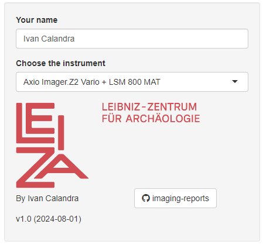
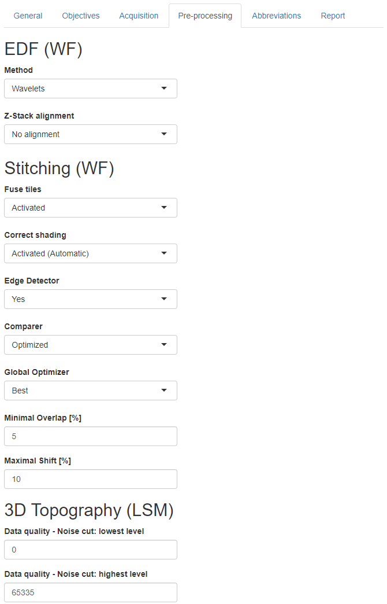
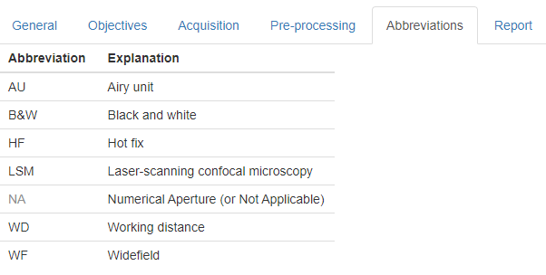
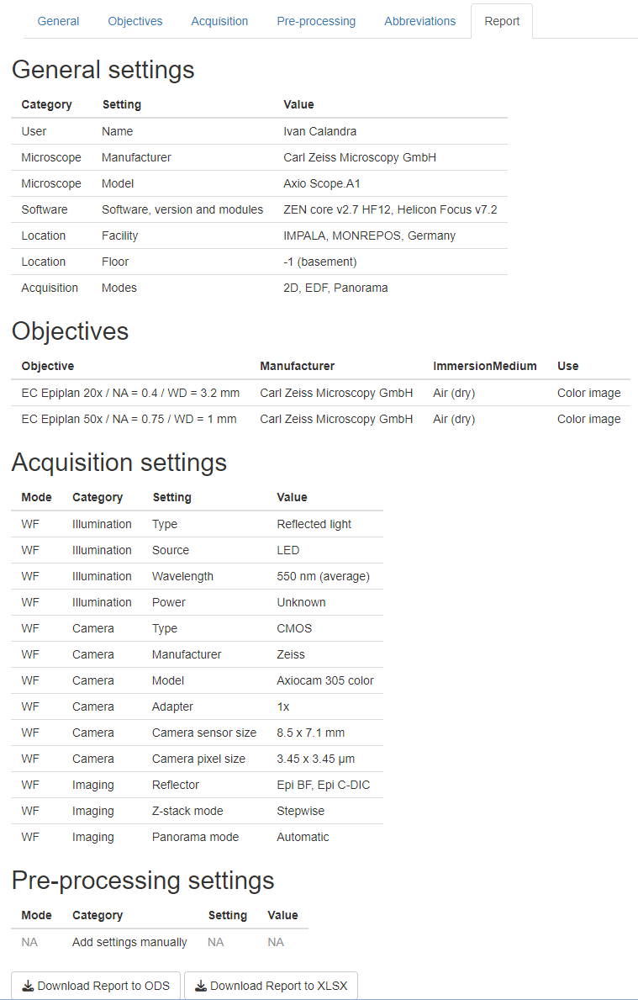

<!-- TOC ignore:true -->
# imaging-reports

<!-- TOC ignore:true -->
## Table of content

<!-- TOC -->

- [Purpose](#purpose)
- [How to use the App](#how-to-use-the-app)
    - [Pre-requisites](#pre-requisites)
    - [Download the repository](#download-the-repository)
    - [Start the App](#start-the-app)
- [Operating instructions](#operating-instructions)
    - [Introduction](#introduction)
    - [Side bar](#side-bar)
    - [Tab "General"](#tab-general)
    - [Tab "Objectives"](#tab-objectives)
        - [Axio Imager.Z2 Vario + LSM 800 MAT](#axio-imagerz2-vario--lsm-800-mat)
        - [Smartzoom 5](#smartzoom-5)
        - [Axio Scope.A1](#axio-scopea1)
        - [Axio Lab.A1](#axio-laba1)
        - [Lateral optical resolution](#lateral-optical-resolution)
    - [Tab "Acquisition"](#tab-acquisition)
        - [Axio Imager.Z2 Vario + LSM 800 MAT](#axio-imagerz2-vario--lsm-800-mat)
        - [Smartzoom 5](#smartzoom-5)
        - [Axio Scope.A1](#axio-scopea1)
        - [Axio Lab.A1](#axio-laba1)
    - [Tab "Pre-processing"](#tab-pre-processing)
        - [Axio Imager.Z2 Vario + LSM 800 MAT](#axio-imagerz2-vario--lsm-800-mat)
        - [Smartzoom 5](#smartzoom-5)
        - [Axio Scope.A1 and Axio Lab.A1](#axio-scopea1-and-axio-laba1)
    - [Tab "Abbreviations"](#tab-abbreviations)
    - [Tab "Report"](#tab-report)
        - [Axio Imager.Z2 Vario + LSM 800 MAT](#axio-imagerz2-vario--lsm-800-mat)
        - [Smartzoom 5](#smartzoom-5)
        - [Axio Scope.A1](#axio-scopea1)
        - [Axio Lab.A1](#axio-laba1)
- [How to adapt the App](#how-to-adapt-the-app)
- [How to contribute](#how-to-contribute)
- [License](#license)

<!-- /TOC -->

---

*The releases are available and citable on Zenodo*\

---

# Purpose

This repository contains a [**Shiny App**](imaging-reports/app.R) that guides users to **create a report for microscope images acquired at the Imaging Platform at LEIZA ([IMPALA](https://www.leiza.de/forschung/infrastrukturen/labore/impala)) with all the necessary metadata.**

Once all fields are entered, **the report can be exported to an ODS or XLSX file**.  

**This report can and should be published together with the image data.** While publishing them as a supplementary material to a paper is OK, I recommend publishing everything in open access on an online repository like [Zenodo](https://zenodo.org/), [Figshare](https://figshare.com/) or [OSF](https://osf.io/) for easy and long-term accessibility. Additionally or alternatively, the report could be attached to a protocol, for example on [protocols.io](https://www.protocols.io/).  
For more details, **check my repo** [**publish-micro-image**](https://github.com/ivan-paleo/publish-micro-image).

The App is designed for the instruments available at the [IMPALA](https://www.leiza.de/forschung/infrastrukturen/labore/impala) and currently includes the digital microscope (Zeiss Smartzoom 5), the upright light microscope + LSCM (Zeiss Axio Imager.Z2 Vario + LSM 800 MAT, abbreviated "LSM"), the reflected light microscope (Zeiss Axio Scope.A1) and the transmitted light microscope (Zeiss Axio Lab.A1). More instruments will be added later.

If you would like to adapt the App to your instrument(s), check the sections [How to adapt the App](#how-to-adapt-the-app), [How to contribute](#how-to-contribute) and [License](#license).

---

# How to use the App
I am planning to make the App available online on a server, but the App can currently only be run locally.

## Pre-requisites
The Shiny App is written in [Shiny](https://shiny.posit.co/) using [RStudio](https://posit.co/products/open-source/rstudio/), so you first need to download and install [R](https://www.r-project.org/) and [RStudio](https://posit.co/download/rstudio-desktop/). But fear not, **no knowledge of R/Rstudio is needed to run the App**!

## Download the repository
There are two ways to get the App: 
1. Download my [GitHub repository](https://github.com/ivan-paleo/imaging-reports/archive/refs/heads/main.zip) or its latest [release](https://github.com/ivan-paleo/imaging-reports/releases) as a ZIP archive, and unzip it. You can access the repository with the source code by clicking on the button in the side bar of the APp (see [side bar](#side-bar)).  
2. [Fork and clone](https://happygitwithr.com/fork-and-clone.html) my GitHub repository.

## Start the App
1.  Open the file [imaging-reports.Rproj](imaging-reports.Rproj) with RStudio.
2.  Open the file `imaging-reports/app.R` from within RStudio by clicking on it in the `Files` panel.

>

>     
>    <i>Open the App from within RStudio.</i>
>

3.  Run the App by clicking on the button `Run App` in the top right corner.

>

>     
>    <i>Run the App from within RStudio.</i>
>

4.  The App will open in a new RStudio window. I recommend to open the App in your browser (click on `Open in Browser` at the top to open the App), and to maximize the window.

>

>     
>    <i>App freshly opened (no input yet).</i>
>

5.  Enter the information as explained in the following section ([Operating instructions](#operating-instructions)).

---

# Operating instructions
## Introduction
- In a strict sense, none of the fields are required. Yet, it is important that **you fill as many fields as possible**. Unedited fields will be filled with default values, so make sure you change them in case you did not apply default values.  
- Some information that will be included in the report (see tab [Report](#tab-report)) is hard coded and does not depend on your input because it depends on the hardware only. Because of that (and also developments and bug fixes), make sure you **use the latest version of the App**.  
- **Every entered information summarizes all acquisitions about which you are reporting.** Therefore, do not fill the forms for every single acquisition bur rather for all acquisitions of a project. Metadata for every acquisition should be made accessible with the acquisition files themselves (see repo [publish-micro-image](https://github.com/ivan-paleo/publish-micro-image)).
- While it is possible to jump from any tab to any other, conditional input (i.e. input based on other input) might not update correctly. Therefore, I recommend that you **start in the [side bar](#side-bar) and then fill in every tab from left (tab [General](#tab-general)) to right (tab [Pre-processing](#tab-pre-processing))**. The tab [Report](#tab-report) can be consulted any time to check how the output will look like, but you might get some errors until you have filled in all tabs.  
- **You can save the settings for one instrument at a time.**  
- **Refer to the instrument's user manual if you need information about the settings.**

## Side bar
**Enter your name and select the instrument you used from the list.**  
Start again at the tab [General](#tab-general) if you switch to another instrument.

Click on the GitHub button to access the repository with the source code.

>

>     
>    <i>Side bar</i>
>

## Tab "General"
**Select the software you used from the list and enter the version(s).**  
Make sure you specify the full details of the version including hot fixes (HF).  
If you used more than 1 software packages, enter the versions in the same order as the software packages and separate them with semi-colons **without** space (e.g. "v12 HF5;v3 HF2"). If available on the instrument, tick the box if you used the module Shuttle-and-Find (correlative microscopy).

Tick the boxes for all acquisition modes you used.

>

>     
>    <i>General tab for the Axio Imager.Z2 Vario + LSM 800 MAT.</i>
>

>

>     
>    <i>General tab for the Smartzoom 5.</i>
>

>

>     
>    <i>General tab for the Axio Scope.A1 and Axio Lab.A1.</i>
>

## Tab "Objectives"
**Select from the list how each objective has been used.**  

### Axio Imager.Z2 Vario + LSM 800 MAT 

- Several uses can be assigned to every objective. To do so, click on every relevant use from the list.  
- `Color image` here is meant in the widest sense to refer to any WF image acquired with the camera, even in black & white mode, with any color filter or with any contrast method (bright field, polarization, dark field, C-DIC). `3D topography` refers to an LSM acquisition. Other choices are `Preview scan` and `Coordinate system`.  
- After selection, click on a use and press `DELETE` to unassign it. Make sure that at least one use is assigned to each objective (select `Not used` if you have not used a given objective).

>

>     
>    <i>Objectives tab for the Axio Imager.Z2 Vario + LSM 800 MAT.</i>
>

### Smartzoom 5
By default, none of the objectives has been used, so make sure you assign a use to at least one objective.  
See [Axio Imager.Z2 Vario + LSM 800 MAT](#axio-imagerz2-vario--lsm-800-mat) for details on choices of uses.

>

>     
>    <i>Objectives tab for the Smartzoom 5.</i>
>

### Axio Scope.A1
See [Smartzoom 5](#smartzoom-5).

>

>     
>    <i>Objectives tab for the Axio Scope.A1.</i>
>

### Axio Lab.A1
See [Smartzoom 5](#smartzoom-5).

>

>     
>    <i>Objectives tab for the Axio Lab.A1.</i>
>

### Lateral optical resolution
Below the fields to assign uses to objectives, a barplot shows the lateral optical resolutions of each used objective. For the Axio Imager.Z2 Vario + LSM 800 MAT, you have the choice for the wavelength of the light source (`Violet laser (405 nm) - LSM` for the LSM 800 MAT or `White LED (550 nm) - WF` for the Axio Imager.Z2 Vario) but only the latter is available on the other instruments.  
The graph can be exported to PDF (vector) or PNG (raster) using the buttons below.

>

>     
>    <i>Graph of lateral optical resolution for each used objective, with download buttons.</i>
>

## Tab "Acquisition"
In case of acquisitions for which no settings can be defined (e.g. simple 2D), the message "No input required" will be displayed in the tab. If you did define some settings, either you did acquire using a different mode and you therefore need to tick the corresponding boxes in the tab [General](#tab-general), or some settings are actually related to pre-processing (especially in case of the Smartzoom 5, see tab [Pre-processing](#tab-pre-processing)).

### Axio Imager.Z2 Vario + LSM 800 MAT  

- Choose the type of illumination: reflected or transmitted.  

>

>     
>    <i>Acquisition tab for the Axio Imager.Z2 Vario + LSM 800 MAT.</i>
>

- In case of an LSM acquisition (`3D topography`): 

  - Enter the information for the objective used for this type of acquisition.    
  - Tick the box `Pinhole diameter = 1 AU` to confirm that the pinhole diameter was set properly.  
  - Enter the step size, the image size in X and Y, and the number of pixels in X and Y for the total image in case stitching was used. **It is currently not possible to enter these pieces of information for several objectives.** It is assumed that only 1 objective has been used for 3D topography.     
  - The pixel size in X and Y is calculated and showed interactively below, as well as whether the Nyquist criterion is fulfilled for this objective. The Nyquist criterion is fulfilled when the pixel size is 2 to 3 times smaller than the lateral optical resolution (see tab [Objectives](#tab-objectives)).  
  - In case the pixel size in X and Y differ, a warning will be displayed that the pixels are not square. The detector can only acquire square pixels, so at least one of the values you entered has to be wrong.
  
>

>     
>    <i>Warning about square pixels for the Axio Imager.Z2 Vario + LSM 800 MAT.</i>
>
 

### Smartzoom 5
The only thing to choose is the z-stack mode (`Continuous` or `Stepwise`) in case of an EDF/3D acquisition. 

>

>     
>    <i>Acquisition tab for the Smartzoom 5.</i>
>

### Axio Scope.A1
Choose the reflector (`Epi BF` or `Epi C-DIC`).  
In case of a panorama acquisition, choose the panorama mode (`Automatic` or `Interactive`). 

>

>     
>    <i>Acquisition tab for the Axio Scope.A1.</i>
>

### Axio Lab.A1
Tick the boxes for the polarization lenses (`Polarizer`, `Analyzer` or `Bertrand lens`) that you used, if any.  
In case of a panorama acquisition, choose the panorama mode (`Automatic` or `Interactive`). 

>

>     
>    <i>Acquisition tab for the Axio Lab.A1.</i>
>

## Tab "Pre-processing"
**Enter the options of the pre-processing methods in this tab.**  
Some acquisition modes do not require pre-processing (e.g. 2D on all instruments), or the settings cannot be changed by the user (e.g. 3D/EDF on the Smartzoom 5). So if you did not select any acquisition mode that requires input about pre-processing settings in the tab [General](#tab-general), a message notifies you of this in the tab Pre-processing.

>

>     
>    <i>No information on pre-processing is needed.</i>
>

Different fields to fill in appear depending on instrument used and on the acquisition modes applied.

### Axio Imager.Z2 Vario + LSM 800 MAT
There are many settings related to EDF, stitching and 3D topography. In most cases, default values can be used.

>

>     
>    <i>Pre-processing tab for the Axio Imager.Z2 Vario + LSM 800 MAT.</i>
>

### Smartzoom 5
Only settings related to stitching require input.

>

>     
>    <i>Pre-processing tab for the Smartzoom 5.</i>
>

### Axio Scope.A1 and Axio Lab.A1
Pre-processing settings cannot be reported yet. WIP.

>

>     
>    <i>Pre-processing tab for the Axio Scope.A1 and Axio Lab.A1.</i>
>

## Tab "Abbreviations"
**This tab lists the abbreviations used in other places of the App.**

>

>     
>    <i>Abbreviations tab.</i>
>

## Tab "Report"
**This tab shows a preview of the entered information.**  
I recommend that you check that everything is correct before you download the report (see below).  
As mentioned already [here](#introduction), it can be that some fields are not updated in this tab. In such cases, go back to the beginning ([side bar](#side-bar)) and follow the tabs from left ([General](#tab-general)) to right ([Pre-processing](#tab-pre-processing)).  
Once done, click on the `Download Report to ODS` or `Download Report to XLSX` button at the bottom of the tab. Save the file to your computer; I recommend to use the name provided. **Check the file.**

**Save one report for each instrument you used.**

### Axio Imager.Z2 Vario + LSM 800 MAT

>

>     
>    <i>Example report with the Axio Imager.Z2 Vario + LSM 800 MAT.</i>
>

### Smartzoom 5

>

>     
>    <i>Example report with the Smartzoom 5.</i>
>

### Axio Scope.A1

>

>     
>    <i>Example report with the Axio Scope.A1.</i>
>

### Axio Lab.A1

>

>     
>    <i>Example report with the Axio Lab.A1.</i>
>

---

# How to adapt the App
I have tried to make the code of the App as clear as possible and to comment it as much as possible. This is surely not perfect, especially because the code is long and imbricated, but I hope this will be enough for future developments and adaptations.

If you would like to adapt the App to your instrument(s), feel free to do so on your own (see section [Download the repository](#download-the-repository)). Nevertheless, **I would appreciate if you would be willing to [contribute](#how-to-contribute)**! You can also get in touch with me directly.

---

# How to contribute
I appreciate any comment from anyone (expert or novice) to improve this App, so do not be shy!  
There are three possibilities to contribute.

1.  Submit an issue: If you notice any problem or have a question, submit an [issue](https://docs.github.com/en/issues/tracking-your-work-with-issues/about-issues). You can do so [here](https://github.com/ivan-paleo/imaging-reports/issues).  
2.  Propose changes: If you know how to write a [Shiny App](https://shiny.rstudio.com/), please propose text edits as a [pull request](https://docs.github.com/en/pull-requests/collaborating-with-pull-requests/proposing-changes-to-your-work-with-pull-requests/about-pull-requests) (abbreviated "PR").
3.  Send me an email: For options 1-2, you need to create a GitHub account. If you do not have one and do not want to sign up, you can still write me an email (Google me to find my email address).

By participating in this project, you agree to abide by our [code of conduct](CONDUCT.md).

---

# License

This work is licensed under a [Creative Commons Attribution-NonCommercial-ShareAlike 4.0 International License](http://creativecommons.org/licenses/by-nc-sa/4.0/). See [LICENSE](LICENSE).

Author: Ivan Calandra

---

*License badge, file and image from Soler S. cc-licenses: Creative Commons Licenses for GitHub Projects, <https://github.com/santisoler/cc-licenses>.*
